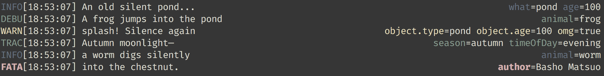

[![npm version][npm_badge]][npm_link] [![Build Status][travis_badge]](travis_link) 
[![downloads][npm_dl_badge]](npm_dl_link) [![js-standard-style][js_standard_badge]][js_standard_link]

# pino-pretty-min 🕉️

A minimalistic [ndjson](http://ndjson.org) formatter for [pino](https://github.com/pinojs/pino). Theme highly inspired
(almost 1:1) by Golang logger called [logrus](https://github.com/sirupsen/logrus). This package wouldn't have happened
if not for [pino-colada](https://github.com/lrlna/pino-colada). Props.



## Usage

```bash
node example.js | pino-pretty-min
```

## Install

```bash
npm install pino-pretty-min
```

## License

- Unlicense (~Public Domain)

## Related Work
- [pino](https://github.com/pinojs/pino)
- [pino-colada](https://github.com/lrlna/pino-colada)
- [logrus](https://github.com/sirupsen/logrus)


[npm_badge]: https://img.shields.io/npm/v/pino-pretty-min.svg?style=flat-square
[npm_link]:  https://npmjs.org/package/pino-pretty-min
[js_standard_badge]: https://img.shields.io/badge/code%20style-standard-brightgreen.svg?style=flat-square
[js_standard_link]:  https://github.com/feross/standard
[travis_badge]: https://travis-ci.org/unjello/pino-pretty-min.svg?branch=master
[travis_link]:  https://travis-ci.org/unjello/pino-pretty-min
[npm_dl_badge]: http://img.shields.io/npm/dm/pino-pretty-min.svg?style=flat-square
[npm_dl_link]: https://npmjs.org/package/pino-pretty-min